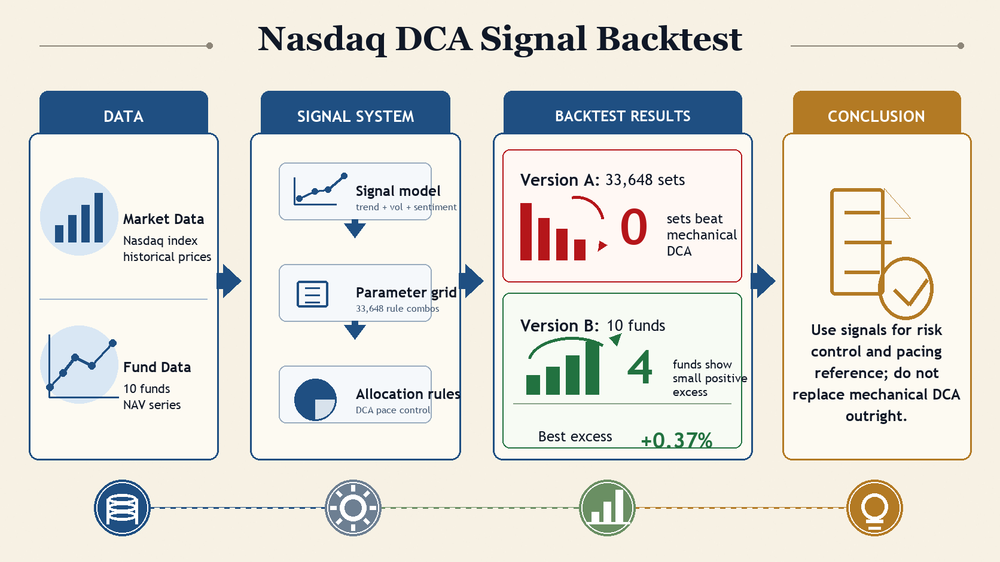
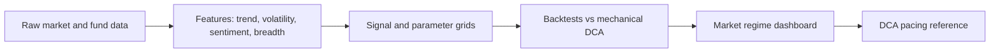

# Nasdaq DCA Backtest / 纳指定投回测

[Live Dashboard](https://nasdaq-invest-analysis.vercel.app) · [Project Summary](reports/project_summary/PROJECT_SUMMARY.md) · [Data Inventory](docs/DATA_INVENTORY.md) · [Project Structure](docs/PROJECT_STRUCTURE.md)



## Overview / 项目概览

**English**: This repository tests whether a Nasdaq 100 DCA pacing system can beat mechanical dollar-cost averaging. The system combines SMA trend, VIX/VXN volatility, CNN Fear & Greed sentiment, and NDXE/SOX market-structure signals. Current evidence says the signal stack is useful for risk control and pacing, but should not replace mechanical DCA as a standalone strategy.

**中文**：本项目用于验证一套纳指 100 定投节奏系统是否能稳定跑赢机械定投。信号体系结合 SMA 趋势、VIX/VXN 波动率、CNN Fear & Greed 情绪、NDXE/SOX 内部结构。当前证据显示，这套信号更适合作为风控和节奏参考，不宜单独替代机械定投。

## Live Dashboard / 在线 Dashboard

Production URL / 线上地址：<https://nasdaq-invest-analysis.vercel.app>


**English**

- **Market State Gauge**: blue marks panic or stress, red marks overheated or top-risk, and middle colors show recovery, normal, and warm transition states.
- **Composite Score Trend**: tracks daily `temperature_score` with `Week`, `Month`, and `Year` views. Unscorable, unavailable, and non-trading `0` rows are excluded.
- **Latest Inputs**: shows the latest NDX, SMA, VIX/VXN, CNN Fear & Greed, NDXE/NDX, and SOX/NDX inputs.
- **Drivers, Risks, Summary**: explains why the current regime was selected and what risk flags are active.
- **Automation**: GitHub Actions fetches data daily; if a new publishable market date exists, it commits the rebuilt dashboard and Vercel auto-deploys it.

**中文**

- **Market State Gauge**：蓝色表示恐慌或压力，红色表示过热或顶部风险，中间颜色表示修复、正常、偏热等过渡状态。
- **Composite Score Trend**：记录每日 `temperature_score`，支持 `Week`、`Month`、`Year` 切换。不可评分、不可发布、非交易日产生的 `0` 分不会画入曲线。
- **Latest Inputs**：展示最新 NDX、SMA、VIX/VXN、CNN Fear & Greed、NDXE/NDX、SOX/NDX 等输入。
- **Drivers, Risks, Summary**：解释当前状态的主要驱动、风险点和摘要。
- **自动更新**：GitHub Actions 每天拉取数据；若有新的可发布交易日，会提交重建后的 dashboard，并由 Vercel 自动部署。

## Key Findings / 核心结论

| Area | English | 中文 |
| :--- | :--- | :--- |
| Version A | 33,648 parameter combinations were tested; 0 beat mechanical DCA. | Version A 跑了 33,648 组参数，0 组跑赢机械定投。 |
| Version B | 10 Nasdaq-related funds were tested; 4 had small positive excess, with best excess near +0.37%. | Version B 测了 10 只纳指相关基金，4 只小幅正超额，最佳超额约 +0.37%。 |
| Version C | PE-percentile strategy is available; from 2000-01-03 to 2026-05-01 it underperformed mechanical DCA by about 3.23 million CNY. | Version C 已加入 PE 百分位回测；按 2000-01-03 到 2026-05-01 口径，少于机械定投约 323.31 万元。 |
| Market Regime | Recommended robustness config classified 2026-04-30 as `warm_recovery`, action `normal_dca`. | 推荐鲁棒性配置截至 2026-04-30 判断为 `warm_recovery`，动作是 `normal_dca`。 |
| Takeaway | Signals are more useful as risk-control overlays than as a replacement for persistent DCA. | 信号更适合作为风控叠加层，不适合替代长期持续定投。 |

## Reports / 报告入口

| Report | Path | 说明 |
| :--- | :--- | :--- |
| Project summary | `reports/project_summary/PROJECT_SUMMARY.md` | 项目总结 |
| Version A overview | `reports/version_a/index.html` | Version A 总览 |
| Version B fund backtest | `reports/version_b_funds/index.html` | Version B 基金回测 |
| Version C PE backtest | `reports/version_c_pe/index.html` | Version C PE 回测 |
| Version C PE 5000 buy | `reports/version_c_pe_5000/index.html` | Version C PE 5000 买入回测 |
| Market regime dashboard | `reports/market_regime/index.html` | 市场状态 Dashboard |
| Robustness report | `reports/market_regime_robustness/index.html` | 市场状态鲁棒性报告 |
| Data inventory | `docs/DATA_INVENTORY.md` | 数据清单 |
| Project structure | `docs/PROJECT_STRUCTURE.md` | 项目结构说明 |

## Method / 方法

**English**: The workflow loads market and fund data, builds features, evaluates multiple signal families, and compares each pacing rule against mechanical DCA. The market-regime dashboard then maps the latest scores into actionable DCA pacing states.

**中文**：流程会加载市场和基金数据，构建特征，评估多组信号体系，并将每套节奏规则与机械定投对比。市场状态 Dashboard 会把最新评分映射为可执行的定投节奏状态。



## Quick Start / 快速运行

```bash
python3 -m venv .venv
. .venv/bin/activate
python -m pip install -r .github/actions-requirements.txt

python -m unittest tests.test_market_regime tests.test_update_vercel_dashboard
python scripts/run_market_regime_dashboard.py --target-date 2026-04-30 --recommended-config-path reports/market_regime_robustness/recommended_config.py
python scripts/run_market_regime_robustness.py --target-date 2026-04-30
```

Common backtest commands / 常用回测命令：

```bash
python scripts/run_version_a_backtest.py
python scripts/run_version_b_funds.py
python scripts/fetch_nasdaq100_pe.py
python scripts/run_version_c_pe_backtest.py
```

To inspect existing outputs, open the HTML and Markdown files under `reports/`.

如只想查看现有结果，直接打开 `reports/` 下的 HTML 或 Markdown 文件即可。

## Repository Layout / 项目结构

```text
data/       Raw, processed, and snapshot data
docs/       Data inventory, structure docs, README assets
public/     Static Vercel output
reports/    Backtest reports and dashboard output
scripts/    Data fetch, backtest, dashboard, and publish workflows
src/        Feature, model, report, and strategy code
tests/      Unit and workflow tests
```

## Deployment / 部署

**English**: Production deployment is GitHub-driven. Commit and push to the GitHub repo, let Vercel auto-deploy, then verify `https://nasdaq-invest-analysis.vercel.app`. Do not use direct `vercel --prod` deployment unless explicitly requested.

**中文**：生产部署走 GitHub 流程。提交并 push 到 GitHub 后，由 Vercel 自动部署，再验证 `https://nasdaq-invest-analysis.vercel.app`。除非明确要求，不直接运行 `vercel --prod`。

## Disclaimer / 免责声明

**English**: This project is a research and monitoring tool. It is not investment advice, return prediction, or a trading recommendation.

**中文**：本项目是研究和监控工具，不构成投资建议、收益预测或交易推荐。
