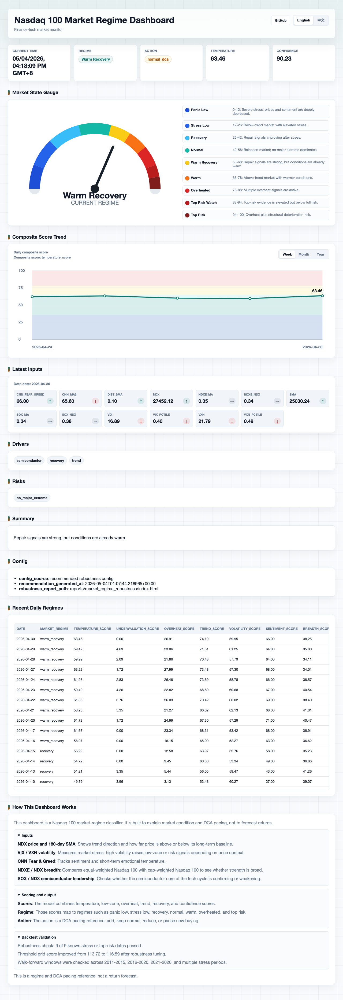

# Nasdaq DCA Backtest

纳指定投信号体系回测项目。项目目标是验证一套由 SMA 趋势、VIX/VXN 波动率、CNN Fear & Greed 情绪、NDXE/SOX 内部结构组成的定投节奏系统，是否能稳定跑赢机械定投。


## 快速入口

| 内容 | 路径 |
| :--- | :--- |
| 项目总结 | `reports/project_summary/PROJECT_SUMMARY.md` |
| Version A 总览 HTML | `reports/version_a/index.html` |
| Version B 基金 HTML | `reports/version_b_funds/index.html` |
| Version C PE 回测 HTML | `reports/version_c_pe/index.html` |
| Version C PE 5000 买入 HTML | `reports/version_c_pe_5000/index.html` |
| 市场状态 Dashboard | `reports/market_regime/index.html` |
| 市场状态鲁棒性报告 | `reports/market_regime_robustness/index.html` |
| 数据清单 | `docs/DATA_INVENTORY.md` |
| 项目结构说明 | `docs/PROJECT_STRUCTURE.md` |

## 市场状态 Dashboard

线上地址：<https://nasdaq-invest-analysis.vercel.app>



### 中文说明

市场状态 Dashboard 是一个 Nasdaq 100 市场环境监控面板，用来解释当前市场状态和定投节奏，不用于预测收益。

- **Market State Gauge**：用红蓝反色仪表盘展示综合状态，蓝色代表恐慌/压力区间，红色代表过热/顶部风险区间，中间颜色表示修复、正常、偏热等过渡状态。
- **Composite Score Trend**：记录每日综合评分，并支持按 `Week`、`Month`、`Year` 切换查看。不可评分、不可发布、非交易日产生的 `0` 分不会画入曲线。
- **Latest Inputs**：展示最新交易日输入指标，包括 NDX、SMA、VIX/VXN、CNN Fear & Greed、NDXE/NDX、SOX/NDX 等。
- **Drivers / Risks / Summary**：解释当前状态的主要驱动、风险点和摘要。
- **Recent Daily Regimes**：展示近期每日市场状态和各项子评分。
- **自动更新**：GitHub Actions 每天拉取数据并重建 dashboard；有新的可发布交易日时提交到 GitHub，由 Vercel 自动部署。

### English Notes

The Market Regime Dashboard monitors the Nasdaq 100 regime and DCA pacing. It explains market condition; it is not a return forecast.

- **Market State Gauge**: uses a blue-to-red gauge. Blue marks panic or stress zones, red marks overheated or top-risk zones, and the middle colors show recovery, normal, and warm transition states.
- **Composite Score Trend**: tracks the daily composite score with `Week`, `Month`, and `Year` views. Unscorable, unavailable, and non-trading rows with `0` scores are excluded from the chart.
- **Latest Inputs**: shows the latest market inputs, including NDX, SMA, VIX/VXN, CNN Fear & Greed, NDXE/NDX, and SOX/NDX.
- **Drivers / Risks / Summary**: explains the main state drivers, risk flags, and current regime summary.
- **Recent Daily Regimes**: lists recent daily regimes and component scores.
- **Auto update**: GitHub Actions fetches data and rebuilds the dashboard daily. When a new publishable market date is available, it commits to GitHub and Vercel auto-deploys it.

## 当前结论

- Version A 跑了 33,648 组参数，0 组跑赢机械定投。
- Version B 测了 10 只纳指相关基金，4 只小幅正超额，最佳超额约 +0.37%。
- 当前信号体系更适合作为风控和节奏参考，不宜直接替代机械定投。
- Version C 已加入 PE 百分位回测入口；按 `2000-01-03` 到 `2026-05-01` 口径，PE 策略终值约 `1014.23` 万，机械定投约 `1337.54` 万，少约 `323.31` 万。
- 当前这套 PE 百分位规则同样没有跑赢机械定投，现阶段更适合作为估值风控参考，而不是直接替代持续定投。
- 市场状态 Dashboard 已加入中英双语仪表盘和鲁棒性阈值测试；推荐配置截至 `2026-04-30` 判断为 `warm_recovery`，动作是 `normal_dca`。

## 常用命令

使用项目内 `.venv`：

```bash
.venv/bin/python -m unittest tests/test_fetch_data.py tests/test_version_a.py tests/test_version_c.py
.venv/bin/python scripts/run_version_a_backtest.py
.venv/bin/python scripts/run_version_b_funds.py
.venv/bin/python scripts/fetch_nasdaq100_pe.py
.venv/bin/python scripts/run_version_c_pe_backtest.py
.venv/bin/python scripts/run_market_regime_dashboard.py --target-date 2026-04-30
.venv/bin/python scripts/run_market_regime_robustness.py --target-date 2026-04-30
```

如只想查看现有结果，直接打开 `reports/` 下的 HTML 或 Markdown 文件即可。
