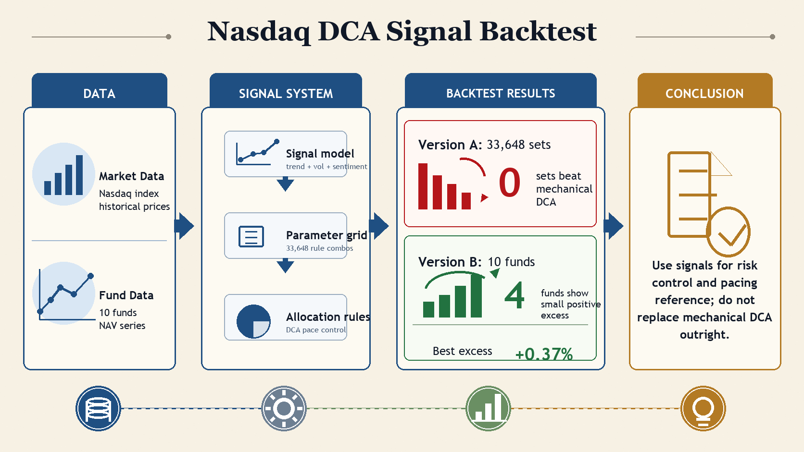
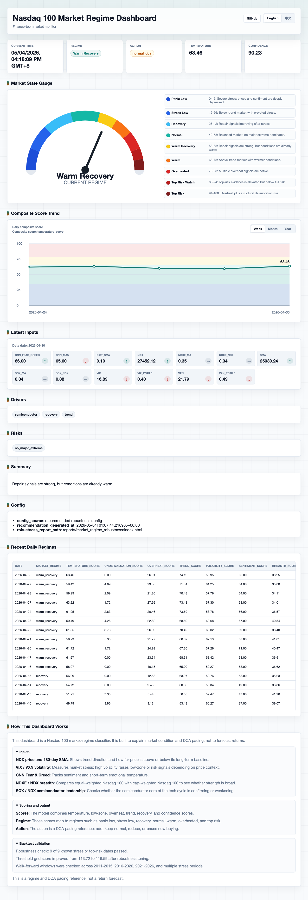
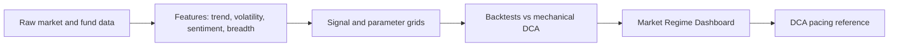

# Nasdaq DCA Backtest / 纳指定投回测

[Live Dashboard](https://nasdaq-invest-analysis.vercel.app) · [Project Summary](reports/project_summary/PROJECT_SUMMARY.md) · [Data Inventory](docs/DATA_INVENTORY.md) · [Project Structure](docs/PROJECT_STRUCTURE.md)



## Overview / 项目概览

**English**: This repository tests whether a Nasdaq 100 DCA pacing system can beat mechanical dollar-cost averaging. The system combines SMA trend, VIX/VXN volatility, CNN Fear & Greed sentiment, and NDXE/SOX market-structure signals. Current evidence says the signal stack is useful for risk control and pacing, but should not replace mechanical DCA as a standalone strategy.

**中文**：本项目用于验证一套纳指 100 定投节奏系统是否能稳定跑赢机械定投。信号体系结合 SMA 趋势、VIX/VXN 波动率、CNN Fear & Greed 情绪、NDXE/SOX 内部结构。当前证据显示，这套信号更适合作为风控和节奏参考，不宜单独替代机械定投。

## Market Regime Dashboard / 市场状态仪表盘

Production URL / 线上地址：<https://nasdaq-invest-analysis.vercel.app>



**English**

- **Market State Gauge**: blue marks panic or stress, red marks overheated or top-risk, and middle colors show recovery, normal, and warm transition states.
- **Composite Score Trend**: tracks daily `temperature_score` with `Week`, `Month`, and `Year` views. Unscorable, unavailable, and non-trading `0` rows are excluded.
- **Latest Inputs**: shows the latest NDX, SMA, VIX/VXN, CNN Fear & Greed, NDXE/NDX, and SOX/NDX inputs.
- **Drivers, Risks, Summary**: explains why the current regime was selected and what risk flags are active.
- **Automation**: Automatic Publish is the recurring release of the Market Regime Dashboard. GitHub Actions fetches Daily Input, determines the Publishable Market Date, skips a Stale Dashboard, commits only Published Artifacts under `public/`, and Vercel auto-deploys from GitHub.

**中文**

- **Market State Gauge**：蓝色表示恐慌或压力，红色表示过热或顶部风险，中间颜色表示修复、正常、偏热等过渡状态。
- **Composite Score Trend**：记录每日 `temperature_score`，支持 `Week`、`Month`、`Year` 切换。不可评分、不可发布、非交易日产生的 `0` 分不会画入曲线。
- **Latest Inputs**：展示最新 NDX、SMA、VIX/VXN、CNN Fear & Greed、NDXE/NDX、SOX/NDX 等输入。
- **Drivers, Risks, Summary**：解释当前状态的主要驱动、风险点和摘要。
- **Automatic Publish**：Automatic Publish 是 Market Regime Dashboard 的 recurring release。GitHub Actions 拉取 Daily Input，确定 Publishable Market Date，跳过 Stale Dashboard，只提交 `public/` 下的 Published Artifacts，并由 Vercel 从 GitHub 自动部署。

## Automatic Publish / 自动发布

Maintainer command / 维护者命令：

```bash
python scripts/publish_market_regime_dashboard.py
```

GitHub Actions runs the same entrypoint with commit and push enabled:

```bash
python scripts/publish_market_regime_dashboard.py --commit --push
```

Automatic Publish commits only Published Artifacts under `public/`: `public/index.html`, `public/latest.json`, and `public/daily_regimes.csv`. Raw data, snapshots, processed data, and Research Reports are not committed by Automatic Publish. Research Reports remain manual/offline artifacts under `reports/` for backtests, robustness analysis, and project findings.

Automatic Publish uses Daily Input to select a Publishable Market Date. If required Daily Input is missing or invalid, the run fails. If the current Published Artifact is already current, the run reports no-op instead of publishing a Stale Dashboard.

Automatic Publish 只提交 `public/` 下的 Published Artifacts：`public/index.html`、`public/latest.json`、`public/daily_regimes.csv`。raw data、snapshots、processed data、Research Reports 不由 Automatic Publish commit。Research Reports 仍是 `reports/` 下的手动/离线研究产物。

## Key Findings / 核心结论

| Area | English | 中文 |
| :--- | :--- | :--- |
| Version A | 33,648 parameter combinations were tested; 0 beat mechanical DCA. | Version A 跑了 33,648 组参数，0 组跑赢机械定投。 |
| Version B | 10 Nasdaq-related funds were tested; 4 had small positive excess, with best excess near +0.37%. | Version B 测了 10 只纳指相关基金，4 只小幅正超额，最佳超额约 +0.37%。 |
| Version C | PE-percentile strategy is available; from 2000-01-03 to 2026-05-01 it underperformed mechanical DCA by about 3.23 million CNY. | Version C 已加入 PE 百分位回测；按 2000-01-03 到 2026-05-01 口径，少于机械定投约 323.31 万元。 |
| Market Regime | Recommended robustness config classified 2026-04-30 as `warm_recovery`, action `normal_dca`. | 推荐鲁棒性配置截至 2026-04-30 判断为 `warm_recovery`，动作是 `normal_dca`。 |
| Takeaway | Signals are more useful as risk-control overlays than as a replacement for persistent DCA. | 信号更适合作为风控叠加层，不适合替代长期持续定投。 |

## Reports / 报告入口

| Report | Path | 说明 |
| :--- | :--- | :--- |
| Project summary | `reports/project_summary/PROJECT_SUMMARY.md` | 项目总结 |
| Version A overview | `reports/version_a/index.html` | Version A 总览 |
| Version B fund backtest | `reports/version_b_funds/index.html` | Version B 基金回测 |
| Version C PE backtest | `reports/version_c_pe/index.html` | Version C PE 回测 |
| Version C PE 5000 buy | `reports/version_c_pe_5000/index.html` | Version C PE 5000 买入回测 |
| Market Regime Dashboard source output | `reports/market_regime/index.html` | Market Regime Dashboard 源输出 |
| Research Report: robustness | `reports/market_regime_robustness/index.html` | Research Report：市场状态鲁棒性 |
| Data inventory | `docs/DATA_INVENTORY.md` | 数据清单 |
| Project structure | `docs/PROJECT_STRUCTURE.md` | 项目结构说明 |

## Method / 方法

**English**: The research workflow loads market and fund data, builds features, evaluates multiple signal families, and compares each pacing rule against mechanical DCA. The Market Regime Dashboard then maps the latest scores into actionable DCA pacing states.

**中文**：研究流程会加载市场和基金数据，构建特征，评估多组信号体系，并将每套节奏规则与机械定投对比。Market Regime Dashboard 会把最新评分映射为可执行的定投节奏状态。


```mermaid
flowchart LR
  A["Raw market and fund data"] --> B["Features: trend, volatility, sentiment, breadth"]
  B --> C["Signal and parameter grids"]
  C --> D["Backtests vs mechanical DCA"]
  D --> E["Market Regime Dashboard"]
  E --> F["DCA pacing reference"]
```

## Quick Start / 快速运行

```bash
python3 -m venv .venv
. .venv/bin/activate
python -m pip install -r .github/actions-requirements.txt

python -m unittest tests.test_market_regime tests.test_maintainer_docs
python scripts/run_market_regime_dashboard.py --target-date 2026-04-30 --recommended-config-path reports/market_regime_robustness/recommended_config.py
python scripts/publish_market_regime_dashboard.py
python scripts/run_market_regime_robustness.py --target-date 2026-04-30
```

Common backtest commands / 常用回测命令：

```bash
python scripts/run_version_a_backtest.py
python scripts/run_version_b_funds.py
python scripts/fetch_nasdaq100_pe.py
python scripts/run_version_c_pe_backtest.py
```

To inspect existing outputs, open the HTML and Markdown files under `reports/`.

如只想查看现有结果，直接打开 `reports/` 下的 HTML 或 Markdown 文件即可。

## Repository Layout / 项目结构

```text
data/       Raw, processed, and snapshot data
docs/       Data inventory, structure docs, README assets
public/     Published Artifacts for the Market Regime Dashboard
reports/    Manual/offline Research Reports and source dashboard output
scripts/    Data fetch, backtest, dashboard, and publish workflows
src/        Feature, model, report, and strategy code
tests/      Unit and workflow tests
```

## Deployment / 部署

**English**: Production deployment is GitHub-driven. Commit and push to the GitHub repo, let Vercel auto-deploy, then verify `https://nasdaq-invest-analysis.vercel.app`. Do not deploy production from the local Vercel CLI.

**中文**：生产部署走 GitHub 流程。提交并 push 到 GitHub 后，由 Vercel 自动部署，再验证 `https://nasdaq-invest-analysis.vercel.app`。不要从本地 Vercel CLI 发布生产环境。

## Disclaimer / 免责声明

**English**: This project is a research and monitoring tool. It is not investment advice, return prediction, or a trading recommendation.

**中文**：本项目是研究和监控工具，不构成投资建议、收益预测或交易推荐。
