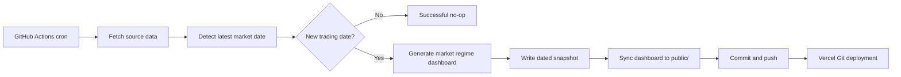

# Vercel Dashboard Auto Update Design

**Date:** 2026-05-04

**Goal:** Deploy only the latest market regime dashboard to Vercel and update it once per trading day after the US market close. GitHub Actions owns data fetching, report generation, dated data snapshots, and commits. Vercel only serves the latest static files from GitHub.

## Scope

In scope:

- Deploy `reports/market_regime/*` as the public static dashboard.
- Keep the public dashboard bilingual in Chinese and English.
- Run a daily GitHub Actions workflow after the US market close.
- Fetch source market data with the existing fail-fast pipeline.
- Generate the latest market regime dashboard.
- Store latest processed/raw data in the existing data paths.
- Store each new trading day's fetched data under a dated snapshot directory.
- Commit changed data and dashboard files to GitHub so Vercel redeploys automatically.
- Treat weekends, US market holidays, and delayed source updates as successful no-op runs when no new trading date is available.

Out of scope:

- Deploying all historical `reports/`.
- Running scraping or report generation inside Vercel functions.
- Manual approval before deploy.
- Adding a market holiday calendar in v1.
- Pruning old snapshots in v1.

## Existing Context

The project already generates static dashboard files with:

```bash
python scripts/fetch_data.py
python scripts/run_market_regime_dashboard.py
```

The latest market regime dashboard currently lives in:

- `reports/market_regime/index.html`
- `reports/market_regime/latest.json`
- `reports/market_regime/daily_regimes.csv`

The whole `reports/` directory is large because it contains many historical run HTML files. The Vercel deployment must not publish all of `reports/`; it should publish only the latest market regime dashboard.

The current data fetcher is intentionally strict. Empty payloads, malformed JSON, unexpected columns, and missing required fields fail the run instead of silently replacing data.

The current dashboard already includes Chinese and English interface text with a language toggle. The deployment workflow must preserve that bilingual output. The public Vercel copy should be byte-for-byte synced from `reports/market_regime/*` rather than rewritten by the workflow.

## Recommended Architecture

Use GitHub Actions as the daily data/update worker and Vercel as a static host.



This keeps Python, pandas, network scraping, and file persistence inside GitHub Actions where logs and repository commits make failures auditable. Vercel receives only static files from the repository.

## Deployment Structure

Add a static Vercel entry directory:

```text
public/
  index.html
  latest.json
  daily_regimes.csv
```

The workflow copies `reports/market_regime/*` into `public/` after each successful dashboard generation.

Vercel should deploy `public/` as the output directory. It should not build or serve the entire repository. This keeps the deployment small and avoids uploading the large historical `reports/` tree.

The deployed `public/index.html` must retain the dashboard's Chinese and English text and language toggle. No deploy-time transform should strip embedded CSS, JavaScript, or localized labels.

## Daily Schedule

Run once per day after the US market close.

Recommended cron:

```cron
0 23 * * *
```

This is 23:00 UTC, which is 07:00 Asia/Shanghai the next morning. It is after the US close in both US daylight saving and standard time. It may be later than necessary during daylight saving time, but it gives FRED and sentiment data more time to update.

The workflow should run every calendar day rather than weekdays only. Weekend and holiday runs are expected to become successful no-ops. Running daily also gives delayed Friday source updates a chance to publish on Saturday or Sunday without waiting until Monday.

The workflow should also support manual dispatch for reruns.

## Workflow Steps

1. Checkout the repository.
2. Set up Python.
3. Install runtime dependencies, at minimum `pandas` and `numpy`.
4. Run `python scripts/fetch_data.py`.
5. Determine the newest market date from `data/processed/market_indicators.csv`.
6. Determine the newest already-published date from existing artifacts:
   - Prefer `reports/market_regime/latest.json` field `as_of_date`.
   - If that is missing, inspect `data/snapshots/*` directory names.
7. If newest fetched market date is not newer than newest published date, exit successfully without committing.
8. If there is a newer market date, run `python scripts/run_market_regime_dashboard.py`.
9. Copy `reports/market_regime/*` into `public/`.
10. Write a dated snapshot under `data/snapshots/<latest_market_date>/`.
11. Validate required output files are present and non-empty.
12. Commit and push changed files if there are changes.
13. Let Vercel auto-deploy from the GitHub push.

## Snapshot Layout

Each new trading day gets its own immutable data snapshot, named by the newest market data date rather than the workflow run date:

```text
data/snapshots/YYYY-MM-DD/
  market_indicators.csv
  data_manifest.json
  raw/
    fred/
      *.csv
    cnn/
      *.json
```

Example: if the workflow runs on 2026-05-05 Asia/Shanghai time but the latest market data date is 2026-05-04, write:

```text
data/snapshots/2026-05-04/
```

This makes future backtests easier because each snapshot represents what the system knew as of a specific market date.

## Files To Commit

When a new market date exists, commit:

- `data/raw/fred/*.csv`
- `data/raw/cnn/*.json`
- `data/processed/market_indicators.csv`
- `data/processed/data_manifest.json`
- `data/snapshots/<latest_market_date>/**`
- `docs/DATA_INVENTORY.md`
- `reports/market_regime/**`
- `public/**`

Do not commit:

- unrelated reports
- build caches
- virtual environments
- temporary workflow files

## Weekend, Holiday, And Delayed-Data Behavior

The workflow should not need a market holiday calendar in v1. It should infer whether a new publish is needed from the fetched data's latest market date.

If the latest fetched market date is less than or equal to the latest already-published dashboard date:

- Mark the workflow successful.
- Do not create a new snapshot.
- Do not regenerate public files.
- Do not commit.
- Log a clear message:

```text
No new market date. Latest fetched: YYYY-MM-DD. Latest published: YYYY-MM-DD.
```

This covers weekends, US market holidays, and sources that have not updated yet.

If fetching returns empty payloads, malformed payloads, missing required columns, missing required JSON fields, or otherwise invalid data, the workflow should fail fast. That is not a no-op.

## Validation

Before committing, validate:

- `data/processed/market_indicators.csv` exists and is non-empty.
- The latest market date is parseable as `YYYY-MM-DD`.
- `reports/market_regime/index.html` exists and is non-empty.
- `reports/market_regime/latest.json` exists and includes `as_of_date`.
- `reports/market_regime/daily_regimes.csv` exists and is non-empty.
- `public/index.html`, `public/latest.json`, and `public/daily_regimes.csv` exist and are non-empty after sync.
- `public/index.html` includes both language variants and the language toggle controls.
- The snapshot directory for the latest market date contains processed data, manifest, and raw source files.

The workflow should fail if any validation fails.

## Vercel Configuration

Vercel should be configured to serve the static `public/` directory. A minimal repository-level config can make this explicit:

```json
{
  "outputDirectory": "public"
}
```

If Vercel's project settings already define the output directory, keep the repository config consistent with that setting.

No Vercel cron job is needed for v1. GitHub Actions is the only scheduler.

## Error Handling

Use fail-fast behavior throughout:

- Network/source format failures fail the workflow.
- Empty or invalid generated outputs fail the workflow.
- Missing snapshot files fail the workflow.
- Git commit should be skipped only when there is no new market date or no file diff after a valid generation.

No fallback data source should be substituted automatically.

## Testing Plan

Implementation should add tests or script-level checks for:

- Latest market date extraction from `market_indicators.csv`.
- Published date extraction from `latest.json`.
- No-op decision when latest fetched date is equal to or older than latest published date.
- Snapshot directory creation and required-file validation.
- Public directory sync.
- Bilingual dashboard markers in `public/index.html`, including Chinese labels, English labels, and language toggle controls.

Manual verification should include:

```bash
python scripts/fetch_data.py
python scripts/run_market_regime_dashboard.py
```

Then verify:

```bash
test -s public/index.html
test -s public/latest.json
test -s public/daily_regimes.csv
```

## Open Decisions

None for v1.

The chosen v1 behavior is:

- GitHub Actions daily after close.
- Direct commit to the deployment branch.
- Store dated snapshots by latest market date.
- Publish only `reports/market_regime/*` through `public/`.
- Preserve Chinese and English dashboard UI in the deployed static HTML.
- Treat non-trading days as successful no-op runs.
