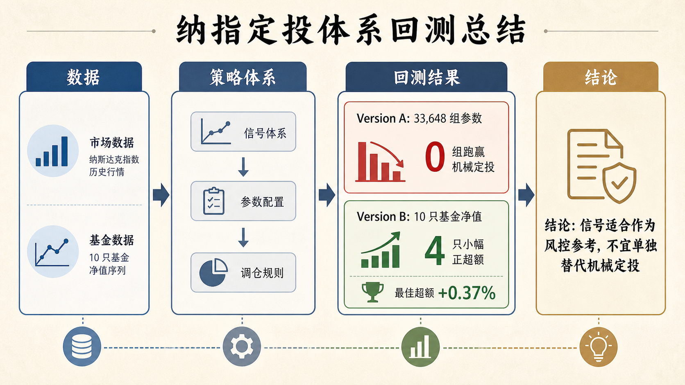

# 纳指定投体系回测总结

## 一句话结论

这轮回测没有证明“信号择时定投”能稳定战胜机械定投。  

Version A 跑了 33,648 组 SMA、情绪阈值、补仓窗口、执行延迟参数，0 组跑赢机械定投；Version B 换成 10 只真实纳指基金净值后，有 4 只基金出现小幅正超额，但最佳也只有 +0.37%。所以当前体系更适合作为“风控和节奏参考”，不适合直接替代机械定投。

## 这个项目到底在验证什么

项目原始目标不是预测每天涨跌，而是回答一个更实用的问题：

> 在长期定投纳斯达克的过程中，用 SMA 趋势、VXN/VIX 波动率、CNN Fear & Greed 情绪、NDXE/SOX 内部结构这些信号，能不能帮助我们少追高、多在恐慌后补仓，从而比固定机械定投更好？

体系分成四层：

| 层级 | 看什么 | 人话解释 |
| :--- | :--- | :--- |
| 趋势层 | NDX 与 SMA 均线 | 市场是在强趋势、弱趋势，还是明显偏热 |
| 情绪层 | VXN、VIX、CNN Fear & Greed | 市场是在恐慌、修复，还是贪婪 |
| 结构层 | NDXE/NDX、SOX/NDX | 纳指内部是不是只有少数权重股撑着 |
| 执行层 | 补仓窗口、暂停窗口、执行延迟 | 信号出现后，实际怎么分天买入 |

## 数据准备情况

市场数据已统一整理到 2000 年至今，但真正用于主回测的核心样本从 2011 年开始，因为 CNN Fear & Greed 的可用历史从 2011-01-03 开始。

| 数据 | 覆盖情况 |
| :--- | :--- |
| 纳指 100 `ndx` | 2000-01-03 至 2026-05-01 |
| VIX | 2000-01-03 至 2026-04-30 |
| VXN | 2001-02-02 至 2026-04-30 |
| NDXE 等权纳指 | 2005-06-28 至 2026-05-01 |
| SOX 半导体指数 | 2004-09-02 至 2026-05-01 |
| CNN Fear & Greed | 2011-01-03 至 2026-05-01 |
| 10 只纳指基金净值 | 最早从 2011-03-29 开始，最晚至 2026-04-29 |

需要注意：2000-2010 可以作为市场数据诊断区间，但不能完整使用 CNN 情绪体系；Version B 的基金样本也不是所有基金都从 2000 年开始。

## 策略是怎么投的

机械定投很简单：每个交易日固定投入 100 元，永远不中断。

策略定投不是凭空加杠杆，而是在同一套现金流规则下调整节奏：

| 状态 | 行为 |
| :--- | :--- |
| 正常 | 每天投入 100 元 |
| 降频 | 每天投入 50 元 |
| 暂停 | 当天不买，现金留存 |
| 轻补/标准补/深补 | 每天最多投入 200 元，持续若干天 |

Version A 中，策略如果暂停买入，未使用的钱会作为现金计入期末资产；也就是说，回测没有把现金“丢掉”。但结果仍然没跑赢机械定投。

## Version A：参数网络回测结果

Version A 做的是参数网络验证：批量跑 SMA、情绪阈值、补仓窗口、暂停窗口、执行延迟等组合，寻找所谓“甜品区间”。

| 指标 | 结果 |
| :--- | ---: |
| 参数组合总数 | 33,648 |
| 粗网格 | 8,748 |
| 细网格 | 24,300 |
| 鲁棒性测试 | 600 |
| 机械定投 ROI | 393.75% |
| 最佳综合评分策略 ROI | 378.90% |
| 最佳综合评分策略超额 | -14.85% |
| 所有组合中的最佳超额 | -14.68% |
| 正超额组合数 | 0 |
| 严格甜品区间 | 0 |
| Version A 超额收益中位数 | -15.54% |

这个结果很明确：在当前 Version A 的规则里，参数怎么调都没有稳定跑赢机械定投。

## Version B：真实基金净值测算结果

Version B 把 Version A 里最高综合评分的参数拿出来，改用真实基金单位净值来计算收益。测试了广发、大成、南方、易方达、华安、国泰、建信、华夏、博时、嘉实等 10 只纳指相关基金。

| 基金 | 策略超额 |
| :--- | ---: |
| 易方达纳斯达克100ETF联接 A 人民币 `161130` | +0.37% |
| 大成纳斯达克100ETF联接 A `000834` | +0.17% |
| 国泰纳斯达克100指数 `160213` | +0.15% |
| 建信纳斯达克100指数 A 人民币 `539001` | +0.14% |
| 华安纳斯达克100ETF联接 A `040046` | -0.01% |
| 广发纳斯达克100ETF联接 A 人民币 `270042` | -0.14% |
| 嘉实纳斯达克100ETF发起联接 A 人民币 `016532` | -0.22% |
| 华夏纳斯达克100ETF发起式联接 A `015299` | -0.26% |
| 南方纳斯达克100指数发起 A `016452` | -0.27% |
| 博时纳斯达克100ETF发起式联接 A 人民币 `016055` | -0.28% |

Version B 的资金口径是公平的：每只基金内部，机械定投和策略定投的总投入相同。  

但结论仍然偏谨慎：4 只基金小幅跑赢，6 只基金小幅跑输，最佳超额也只有 +0.37%。这不是一个足以支撑实盘替代机械定投的稳定优势。

## 为什么策略没赢

核心原因不是代码问题，而是策略行为本身的代价：

1. 纳指长期样本是强趋势长牛，长期持仓暴露非常重要。
2. 策略为了避免追高，会暂停或降频买入，但这也会减少牛市中的在场时间。
3. 补仓窗口最多每天 200 元，补仓强度不足以弥补前面少买造成的长期差距。
4. 情绪和结构信号可以识别风险，但识别风险不等于一定能提高最终收益。
5. 真实基金净值下有少量改善，说明信号不是完全无用，但改善非常薄，不稳定。

简单说：这个体系确实能让买入节奏“更聪明一点”，但在当前场外定投规则下，还不够聪明到战胜最朴素的长期机械定投。

## 对“场内快速大量补仓和卖出”的判断

目前结果不能直接回答“如果是场内 ETF，可以快速大量补仓和卖出，会不会好很多”。因为当前 Version A/B 都主要模拟的是定投节奏，不是完整的场内战术交易系统。

理论上，场内版本可能改善三件事：

| 可能改善点 | 为什么 |
| :--- | :--- |
| 补仓强度 | 场内不受 200 元/天这种慢速窗口限制，可以在恐慌后更快部署资金 |
| 执行价格 | ETF 可以盘中或收盘成交，不必完全依赖基金净值确认 |
| 卖出机制 | 可以测试高位减仓、战术仓止盈，而不只是暂停新增 |

但它也会引入新风险：追信号更频繁、交易费用与滑点更真实、卖飞长牛行情的概率更高。所以需要单独做 Version C，不能用 Version A/B 的结果直接推断。

## 当前可用结论

可以采用的结论：

- 机械定投仍是当前项目里最强的收益基准。
- SMA、VIX/VXN、CNN、NDXE/SOX 这些信号可以作为风控仪表盘。
- 当前信号体系不适合直接替代机械定投。
- 如果实盘使用，更合理的方式是“机械定投为主，信号用于提醒暂停追高或准备补仓”。
- 下一步若要追求超额，应该测试场内 ETF 的 Version C，而不是继续在场外慢速定投参数里微调。

## 建议的下一版：Version C

Version C 应该专门回答场内交易问题：

1. 标的改为场内 ETF 或可交易代理价格。
2. 加入更大的恐慌补仓额度，而不是最多 200 元/天。
3. 单独设计战术仓卖出规则，不动核心仓。
4. 加入交易费、滑点、汇率或溢价折价影响。
5. 继续要求与机械定投比较，并按 2020、2022、2023-2026 等阶段拆开看。

如果 Version C 仍然不能形成连续参数甜品区间，那就说明这套信号更适合做“风险提示系统”，而不是自动收益增强系统。

## 主要产物位置

| 产物 | 路径 |
| :--- | :--- |
| Version A 总览报告 | `reports/version_a/index.html` |
| Version A 参数结果 | `reports/version_a/summary.csv` |
| Version B 基金报告 | `reports/version_b_funds/index.html` |
| Version B 基金结果 | `reports/version_b_funds/summary.csv` |
| 本总结 Markdown | `reports/project_summary/PROJECT_SUMMARY.md` |
| 本总结图 | `reports/project_summary/assets/nasdaq_backtest_summary_image2.png` |

